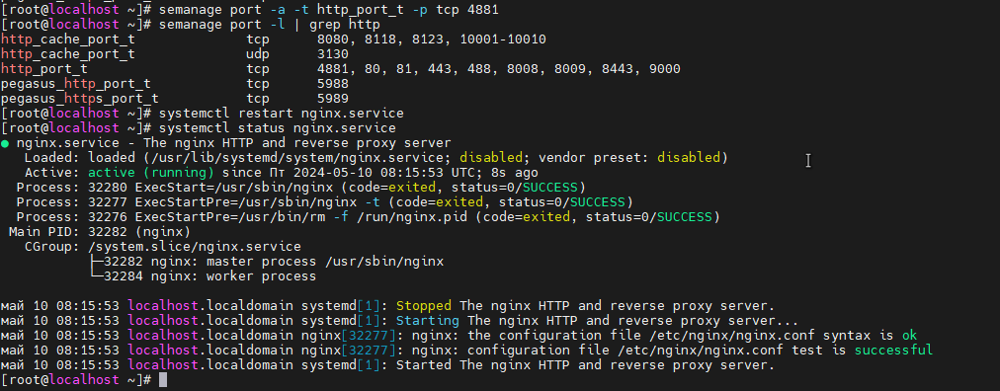

# SELinux
H/W SELinux - когда все запрещено 
1. **Запуск nginx на нестандартном порту 3-мя разными способами**
2.   ``` vagrant up ```  разворачиваем виртуальную машину
3.   Проверяем nginx  и режим работы SELinux. Должен отображаться режим Enforcing. Данный режим означает, что SELinux будет блокировать запрещенную активность.   
4.    
5. Заходим в файл конфигурации nginx и меняем порт на 4881 -  ``` nano /etc/nginx/nginx.conf ```  Запустить на таком порту не получается.
6. Далее выполняем команду  ``` audit2why < /var/log/audit/audit.log  ```, для того чтобы понять что включать.
7. Утилита audit2why отображает комманду для выполнения  ``` setsebool -P nis_enabled 1  ```   
8.   
9.   После этого сервер nginx запускается
10.    
11.    
12.  Вернем запрет работы nginx на 4881 порту   ``` setsebool -P nis_enabled off ```   После этого сервер nginx не запустится.
13.  **Теперь разрешим в SELinux работу nginx на порту TCP 4881 c помощью добавления нестандартного порта в имеющийся тип**
14.   Выполним комманду  ``` semanage port -l | grep http  ``` что бы узнать какие порты открыты для http
15.   
16.   Добавляем наш не стандартный порт  ``` semanage port -a -t http_port_t -p tcp 4881  ```
17.   Запускаем ngnix и проверяем что все работает
18.   
19.   
20.   
