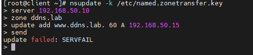
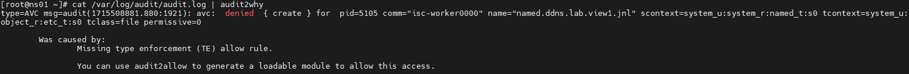
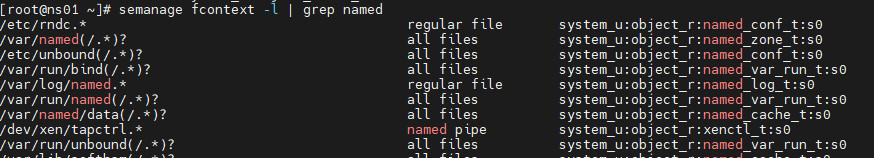
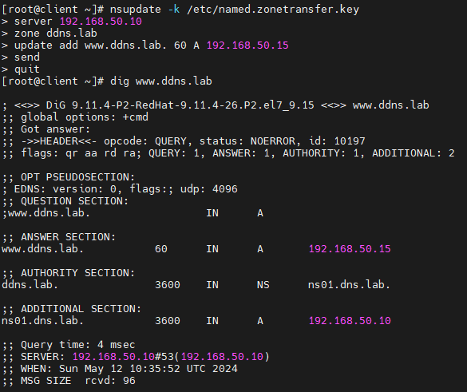

# SELinux
H/W SELinux - когда все запрещено 
1. **Запуск nginx на нестандартном порту 3-мя разными способами**
2.   ``` vagrant up ```  разворачиваем виртуальную машину
3.   Проверяем nginx  и режим работы SELinux. Должен отображаться режим Enforcing. Данный режим означает, что SELinux будет блокировать запрещенную активность.   
4.    
5. Заходим в файл конфигурации nginx и меняем порт на 4881 -  ``` nano /etc/nginx/nginx.conf ```  Запустить на таком порту не получается.
6. Далее выполняем команду  ``` audit2why < /var/log/audit/audit.log  ```, для того чтобы понять что включать.
7. Утилита audit2why отображает комманду для выполнения  ``` setsebool -P nis_enabled 1  ```   
8.   
9.   После этого сервер nginx запускается
10.    
11.    
12.  Вернем запрет работы nginx на 4881 порту   ``` setsebool -P nis_enabled off ```   После этого сервер nginx не запустится.
13.  **Теперь разрешим в SELinux работу nginx на порту TCP 4881 c помощью добавления нестандартного порта в имеющийся тип**
14.   Выполним комманду  ``` semanage port -l | grep http  ``` что бы узнать какие порты открыты для http
15.   
16.   Добавляем наш не стандартный порт  ``` semanage port -a -t http_port_t -p tcp 4881  ```
17.   Запускаем ngnix и проверяем что все работает
18.   
19.    Удалим наш не стандартный порт  ``` semanage port -d -t http_port_t -p tcp 4881  ```
20. **Разрешим в SELinux работу nginx на порту TCP 4881 c помощью формирования и установки модуля SELinux**
21.    ``` systemctl start nginx  ``` -  не запускается , так как SELinux продолжает его блокировать. Посмотрим логи SELinux, которые относятся к nginx
22. Посмотрим логи SELinux, которые относятся к nginx   ``` grep nginx /var/log/audit/audit.log  ```
23.  Воспользуемся утилитой audit2allow для того, чтобы на основе логов SELinux сделать модуль, разрешающий работу nginx на нестандартном порту
24.   ``` grep nginx /var/log/audit/audit.log | audit2allow -M nginx  ```
25.   Audit2allow сформировала команду  ``` semodule -i nginx.pp  ``` после выполнения которой можно запускать nginx и проверять status
26.    
## Обеспечение работоспособности приложения при включенном SELinux
1.  Выполним клонирование репозитория:  ``` git clone https://github.com/mbfx/otus-linux-adm.git  ``` или из директории selinux_dns_problems  **vagrant up** из данного каталога развернет стенд с 2-мя виртуальными машинами
2.  Подключаемся к клиенту ``` vagrant ssh client ```
3.   Попробуем внести изменения в зону: ``` nsupdate -k /etc/named.zonetransfer.key ```

1. Далее клонируем репозиторий **git clone https://github.com/mbfx/otus-linux-adm.git**
2. выполняем все как в методичке, создаем Vagrantfile , поднимаются 2 машины. Ansible отрабатывает.
3.  
4.  Далее должны внести изменения в зону: **nsupdate -k /etc/named.zonetransfer.key** и получаем ошибку 
5.   
6.   Изменения внести не получилось.   На клиенте выполняем команду ``` audit2why < /var/log/audit/audit.log ```  - вывод пустой. Эту же команду выполняем на ns01 вывод есть
7.   
8.   В логах мы видим, что ошибка в контексте безопасности. Вместо типа **named_t** используется тип **etc_t**.
9.   Проверим каталог /etc/named:  командой ``` ls -laZ /etc/named ```
10.   
11.   Контекст безопасности неправильный. Конфигурационные файлы лежат в другом каталоге. Посмотреть в каком каталоги должны лежать, файлы, чтобы на них распространялись правильные политики с помощью команды: ```  semanage fcontext -l | grep named ```
12.   
13.   Изменим тип контекста безопасности для каталога **/etc/named**: ``` chcon -R -t named_zone_t /etc/named ```  И пробуем проверить. Вносим изменения.
14.   
15.   Изменения применились
16.   ## Итог второй части задания
17.   Причина неработоспособности обновления в том что Selinux блокировал доступ к обновлению файлов для DNS сервера, а также к некоторым файлам ОС, к которым DNS сервер (/usr/sbin/named) обращается. также как решение можно временно выключить SELinux (не рекомендуется)


